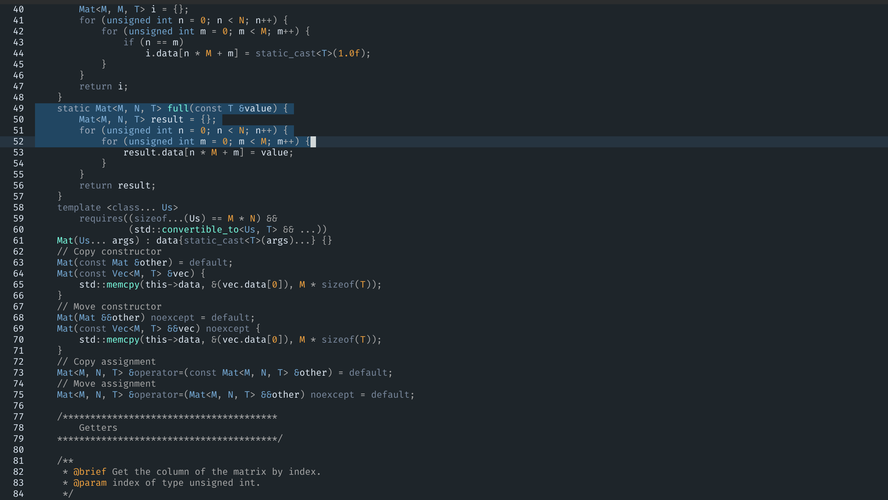
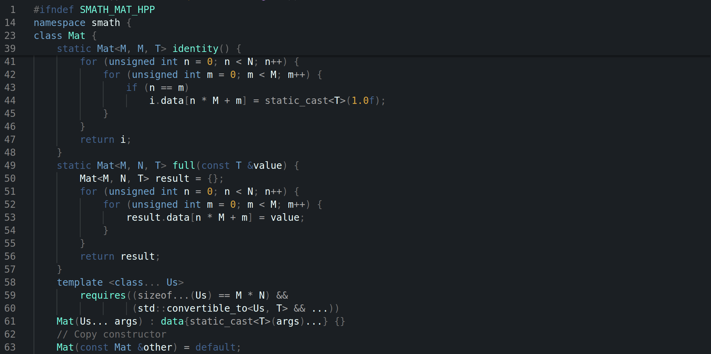

# Iceberg Theme

Welcome to my first theme repository! It is a **VsCode/Helix** Theme conforming to the iceberg colour.

> ### Helix
>
> 
> Put the `Iceberg.toml` file to `~/.config/helix/themes/`.
>
> ### Vscode
>
> 
> Go to the `vscode/` and run `vsce package`, after `iceberg-theme-0.0.1.vsix` is generated, right-click it and select `Install Extension VSIX`
